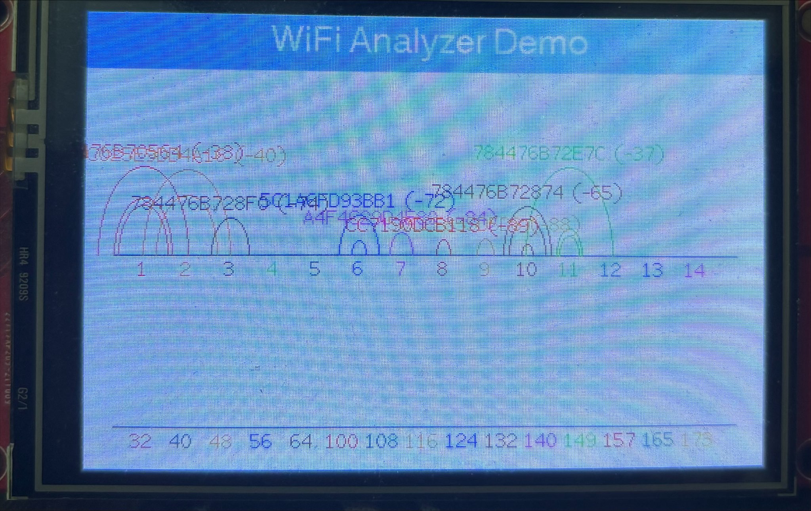

# RTL8720 TFT LCD Demo

[](mailto:longhd4196@gmail.com)

This is a demo using RTL8720 to display on the ILI9488 TFT screen, scan for Wi-Fi networks, and display the graph.

Support both WiFi 2.4GHz and 5GHz.

This library has been tested on RTL8720 with ILI9488 LCD.

## Library
https://github.com/Bodmer/TFT_eSPI

## TFT setup
To use custom pin setting, please read
[README.md](Guide/README.md)

### Custom setup file
```cpp
#define ILI9488_DRIVER

/* TFT pins */
#define TFT_MOSI                              PA12    /* PA12 */
#define TFT_MISO                              PA13    /* PA13 */
#define TFT_SCLK                              PA14    /* PA14 */

#define TFT_CS                                PA30    /* PA30 */
#define TFT_RST                               PB3     /* PB3 */
#define TFT_DC                                PA27    /* PA27 */

#define TOUCH_CS                              -1

#define LOAD_GLCD     /* Font 1. Original Adafruit 8 pixel font needs ~1820 bytes in FLASH */
#define LOAD_FONT2    /* Font 2. Small 16 pixel high font, needs ~3534 bytes in FLASH, 96 characters */
#define LOAD_FONT4    /* Font 4. Medium 26 pixel high font, needs ~5848 bytes in FLASH, 96 characters */
#define LOAD_FONT6    /* Font 6. Large 48 pixel font, needs ~2666 bytes in FLASH, only characters 1234567890:-.apm */
#define LOAD_FONT7    /* Font 7. 7 segment 48 pixel font, needs ~2438 bytes in FLASH, only characters 1234567890:-. */
#define LOAD_FONT8    /* Font 8. Large 75 pixel font needs ~3256 bytes in FLASH, only characters 1234567890:-. */
#define LOAD_GFXFF    /* FreeFonts. Include access to the 48 Adafruit_GFX free fonts FF1 to FF48 and custom fonts */

#define SMOOTH_FONT

#define SPI_FREQUENCY                         66000000
#define SPI_READ_FREQUENCY                    20000000
#define SPI_TOUCH_FREQUENCY                   2500000
```

### Output
